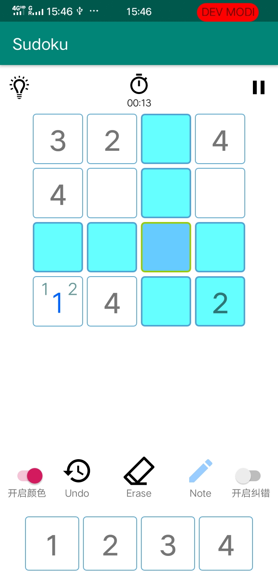
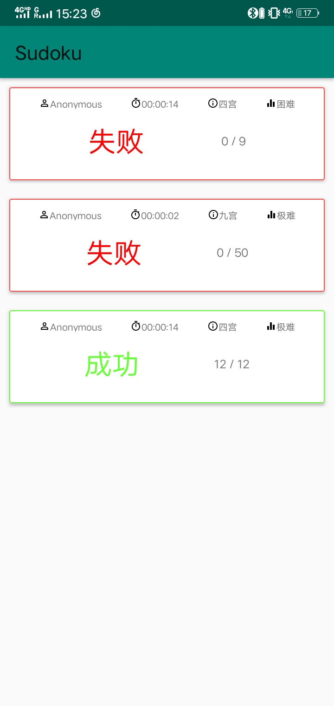

# SoftwareEngineeringProject
华中科技大学 软件工程大作业 数独APP

## 组员

[lrm142857](https://github.com/lrm142857)

[swliky](https://github.com/swliky)

[Samuel.G](https://github.com/HUSTERGS)

# 项目概述

希望可以通过App的形式将数独这一游戏带给大家,解决广告以及错误次数限制等问题.详情请见[NABCD模型文档](NABCD.md)以及[项目说明书]([https://github.com/HUSTERGS/SoftwareEngineeringProject/blob/master/assignment/2019%E3%80%8A%E8%BD%AF%E4%BB%B6%E5%B7%A5%E7%A8%8B%E3%80%8B%E9%A1%B9%E7%9B%AE%E4%BB%BB%E5%8A%A1%E4%B9%A6%EF%BC%882017%E7%BA%A7%EF%BC%89.docx](https://github.com/HUSTERGS/SoftwareEngineeringProject/blob/master/assignment/2019《软件工程》项目任务书（2017级）.docx))

> 最终的数独以及安卓代码均在在[SudokuApp-GS](https://github.com/HUSTERGS/SoftwareEngineeringProject/tree/master/SudokuApp-GS/Sudoku)下，对`dlx`类也做了一些修改，如为了将其放到子线程中运行改为了`Runable`的子类

# 具体实现

## 数独部分

实时生成具有唯一解的数独, 采用先生成终局后挖洞的方式,考虑到移动设备的算力可能不足的问题,使用了目前速度最快(待求证)的[Dancing Links](https://en.wikipedia.org/wiki/Dancing_Links)算法以来解数独,具体实现参考此[论文](dancing-color.ps.pdf)以及此[仓库](https://github.com/rafalio/dancing-links-java/), 挖洞参考了百度文库的[一篇论文](https://wenku.baidu.com/view/f9e3f17101f69e31433294e1.html)来提高挖洞效率,其中的剪枝操作极大的减少了挖洞所需要的时间.

## 安卓部分

> 速成， 主要参考郭霖的[第一行代码](https://book.douban.com/subject/26915433/)，[Google官方文档](https://developer.android.com/)，以及`Material UI`的[文档](https://material.io/develop/android/)，由于各种原因，其实真正的开发时间没有很长

储存数据用到了[LitePal](https://github.com/LitePalFramework/LitePal/)、安卓原生提供的本地数据库以及`SP`，由于种种不可抗力，没有实现真正的登录注册功能，只是在本地写了个假的。也没有提供显式的结算按钮，如需结算，请另开一局新的，旧的数据会被储存在历史中，即变相结算？

没有特殊原因应该不会继续完善

### 截图

> 其他的部分实在太丑了，就不截图了。。。

## TODO

### 数独类型

- [x] 四宫
- [x] 九宫
- [ ] 六宫
- [ ] 不规则

### 基本操作

- [x] 填入/擦除数字
- [x] 高亮同一列同一行以及同一个小方格的数字
- [x] 实时纠错
- [x] 方格内做笔记
- [x] 计时/暂停
- [x] 撤回
- [x] 难度选择
- [x] 提示指定方格
- [x] 恢复上一次进度

### 模式选择

- [ ] 闯关模式
- [ ] 限时模式
- [ ] 联机模式

### 用户

- [x] 登录注册 (Fake)
- [x] 历史数据

### 其他

- [ ] 查看解题技巧
- [ ] 查看排名
- [ ] 国际化

